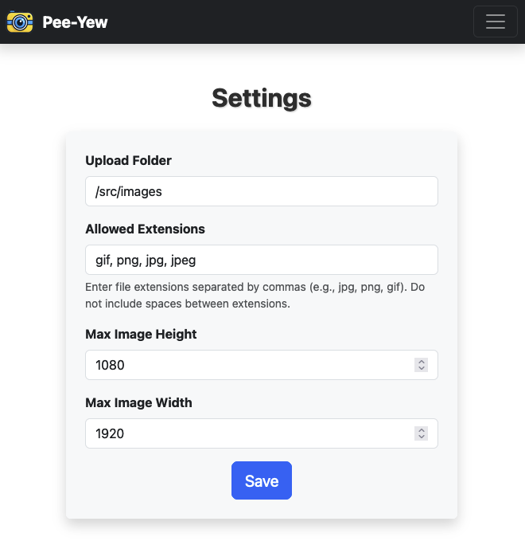
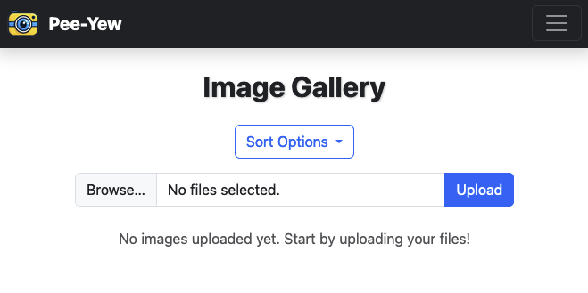
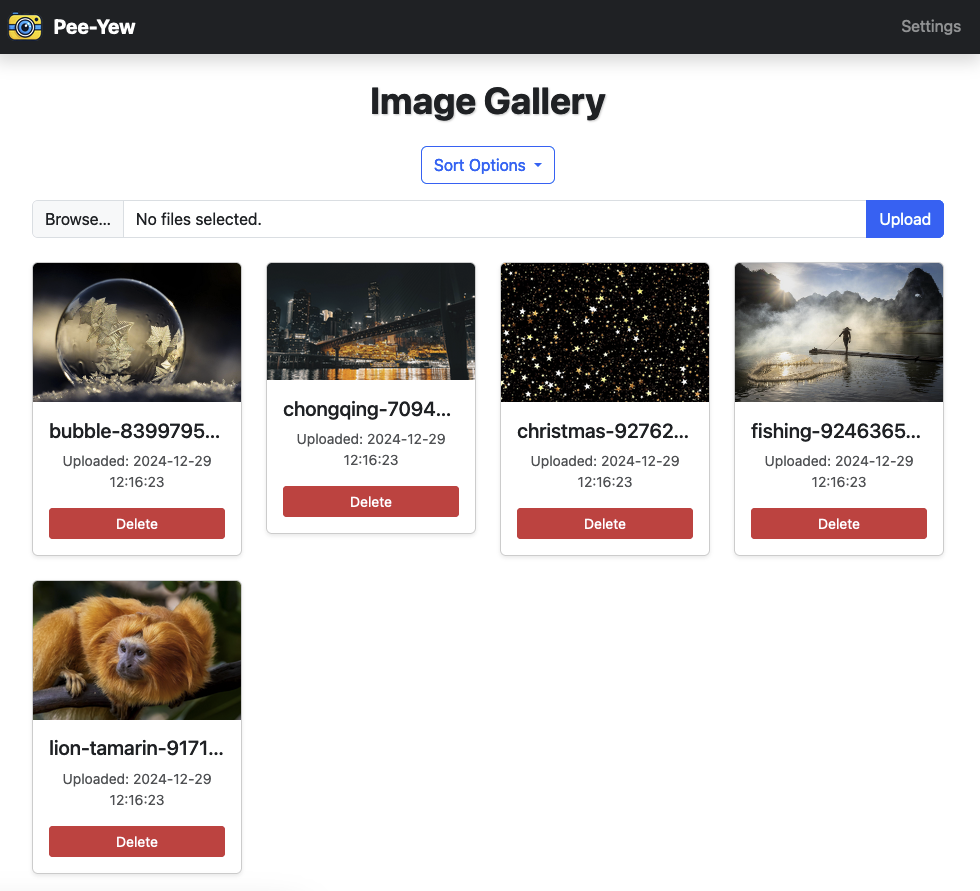

# Pee-Yew Photo Uploader


**Pee-Yew Photo Uploader** is a web application designed to upload images to a select directory. It features a user-friendly interface for uploading images, sorting them by name or date, and displaying them in a gallery format. Users can also delete images directly from the interface.

This is a good option for uploading files to a photo-slideshow. 

## Gallery Section

|                                       |                                       |
|:-------------------------------------:|:-------------------------------------:|
|  ||
|  ||

## Features

- **Image Upload**: Supports multiple file uploads at once.
- **Sorting Options**: Sort images by:
  - Name (A-Z)
  - Name (Z-A)
  - Date (Oldest First)
  - Date (Newest First)
- **Responsive Gallery**: Displays images in a grid layout with preview and details.
- **Image Management**: Allows users to delete uploaded images, and to resize images to a max height and width.
- **Configuration Management**: Settings can be changed via web UI or command line arguments.
- **File Size Limits**: Configurable maximum file size for uploads.
- **Enhanced Security**: Filename sanitization and path traversal protection.
- **Better Error Handling**: Comprehensive error handling with user feedback.
- **Logging**: Application activity logging for debugging and monitoring.

## Technologies Used

- **Frontend**: HTML5, CSS3, Bootstrap
- **Backend**: Flask (Python)
- **Template Engine**: Jinja2
- **Additional Libraries**: Bootstrap 5 for responsive design and modern UI components.

## Setup and Installation

1. **Clone the Repository**:
   ```bash
   git clone https://github.com/JoeWalters/photo-uploader.git
   cd photo-uploader
   ```
2. **Install Dependencies**:
   ```bash
   pip install -r requirements.txt
   ```
3.	**Settings**:
    Here are some settings in the Python script which you might wish to change.
    Descriptions which start with an asterisk `*` denote a setting which is also available in the WebGUI. 
    | Variable | Description |
    | -------- | -------- |
    | `port=` | The port on which this site will run on |
    | `UPLOAD_FOLDER` | * Where to upload images |
    | `ALLOWED_EXTENSIONS` | * Which extensions to allow |
    | `MAX_HEIGHT` | * Max height of uploaded images. Taller images will be shrunk to fit. |
    | `MAX_WIDTH` | * Max width of uploaded images. Wider images will be shrunk to fit. |
4. **Run the Application**:
   ```bash
   python3 photo_uploader.py
   ```
   The application will be accessible at `http://<your-ip>:5001`.

## Docker Deployment

### Quick Start with Docker
```bash
docker run -d \
  --name photo-uploader \
  -p 5001:5001 \
  -v ./config:/app/config \
  -v ./uploads:/app/uploads \
  --restart unless-stopped \
  joewalters/photo-uploader:latest
```

### Docker Compose
```bash
git clone https://github.com/JoeWalters/photo-uploader.git
cd photo-uploader
docker-compose up -d
```

### Unraid
Search for "Photo Uploader" in Community Applications or see [DOCKER.md](DOCKER.md) for detailed setup instructions.

**See [DOCKER.md](DOCKER.md) for complete Docker deployment guide.**

### Command Line Options
You can customize settings via command line arguments:
```bash
python3 photo_uploader.py --upload-folder ~/my_photos --port 8080 --host 127.0.0.1
```

Available options:
- `--upload-folder`: Set upload directory path
- `--port`: Set server port (default: 5001)
- `--host`: Set server host (default: 0.0.0.0)
- `--debug`: Enable debug mode
- `--max-file-size`: Set maximum file size in MB

### Configuration File
Settings are stored in `config/config.json` and persist between runs. You can edit this file directly to customize your setup.

#### Configuration Structure:
```json
{
    "server": {
        "host": "0.0.0.0",
        "port": 5001,
        "debug": false
    },
    "upload": {
        "folder": "~/photo_uploads",
        "max_file_size_mb": 10,
        "allowed_extensions": ["png", "jpg", "jpeg", "gif", "webp"]
    },
    "image_processing": {
        "max_width": 1920,
        "max_height": 1080,
        "auto_rotate": true,
        "optimize": true,
        "quality": 85
    }
}
```

See `config/README.md` for detailed configuration options.

## How to Use
1.	**Settings**:
    Press the Settings button in the top right of the page
    | Option | Description |
    | -------- | -------- |
    | `Upload Folder` | Where to upload images |
    | `Allowed Extensions` | Which extensions to allow |
    | `Max Image Height` | Max height of uploaded images. Taller images will be shrunk to fit. |
    | `Max Image Width` | Max width of uploaded images. Wider images will be shrunk to fit. |
2.	**Upload Images**
	* Select images using the “Choose File” button.
	* Click “Upload” to add the images to the gallery.
3.	Sort Images:
    * Use the Sort Options dropdown to organize images by name or date.
4.	Delete Images:
    * Click the “Delete” button below an image to remove it.

## License

This project is licensed under the [LGPL v3.0](https://www.gnu.org/licenses/lgpl-3.0.html).

You are free to use, modify, and distribute this software under the terms of the Lesser General Public License version 3.0. If you make modifications to this software, you must make those modifications available under the same license. However, you may link this software with proprietary programs under certain conditions. 

For more details, refer to the full [LGPL v3.0 license text](https://www.gnu.org/licenses/lgpl-3.0.html).